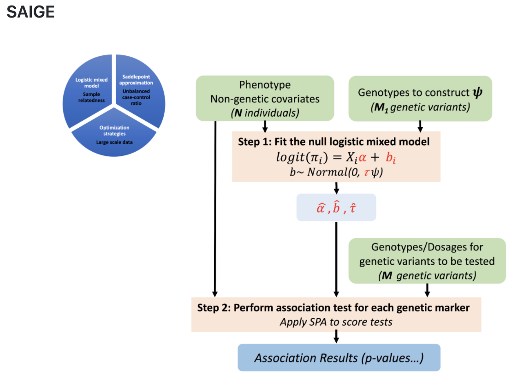

# DAY 3 - Genome-Wide Association Studies using SAIGE - binary trait

### FOCUS and LEARNING GOALS
> The aim for this session is to get familiar with the running of GWAS-analysis. Running a GWAS on a regular size dataset could take anywhere from 1 to >24 hours depending on the number of samples, number of genetic variants, the file format and the number of central processing units (CPUs) you have available.  For learning purposes we have created a small dataset that will run within the time frame we have. 

Running a GWAS will often be the second step after 1) quality control (QC) of genotype+imputation data and 2) curation of the phenotype. This type of analysis is often referred to as “hypothesis generating” because it yields a long list of potentially disease-causing genetic loci which can be further studied via functional studies. 

**Suggested reading:**
* [Zhou, W. et al.Efficiently controlling for case-control imbalance and sample relatedness in large-scale genetic association studies. Nature Genetics 50, 1335–1341 (2018).](https://www.nature.com/articles/s41588-018-0184-y.pdf)
* [Zhou, W. et al. Scalable generalized linear mixed model for region-based association tests in large biobanks and cohorts. bioRxiv 583278 (2019)](https://www.biorxiv.org/content/10.1101/583278v2)

**SAIGE:**  https://github.com/weizhouUMICH/SAIGE
*  
**SAIGE** (Scalable and Accurate Implementation of GEneralized mixed model) is an analysis tool developed to handle both relatedness within the population and an unbalanced case control ratio. This makes it an especially important tool when working with binary traits in population studies where the number of cases often are substantially lower than the number of controls. SAIGE performs single-variant association tests for binary traits and quantitative traits. For binary traits, SAIGE uses the saddlepoint approximation (SPA)(mhof, J. P. , 1961; Kuonen, D. 1999; Dey, R. et.al 2017) to account for case-control imbalance.

SAIGE is an R package with Scalable and Accurate Implementation of Generalized mixed model (Chen, H. et al. 2016). It accounts for sample relatedness and is feasible for genetic association tests in large cohorts and biobanks (N > 400,000).
SAIGE is run in a two-step process. In step 1 the relatedness between individuals is calculated, by fitting the null logistic mixed model using fitNULLGLMM. 
The output from this step can be saved and used as input in step 2 for performing single-variant association tests using the same population. 

## TASK: Running a GWAS using SAIGE
Today we will run a gwas analysis using SAIGE. Because of time restraints we have made a small data-set that will run within reasonable time. The data will not generate significant results.

The phenotype in today's practical is dummy phenotype created for this practical but based on real data from the HUNT-study.  The data-set consist of 1000 of cases  and 1000 controls and only chr 16. 

The analysis pipeline comprises of step 1 and 2 in SAIGE, followed by merging of data (step 3), and plotting the results (step 4).
*run_gwas.sh specify the options used in the other scripts*.

#### TASK outline:

* Run  SAIGE STEP 1 using the commands in the instructions
* HAVE A COFFEE  or a biobreak or ask questions to the lecturers. 
* Identify files needed for SAIGE STEP 2
* Run SAIGE STEP 2 using the commands in the instructions
* Merging results from the 4 chunks
* Refill your COFFEE 
* Identify our output/results files
* Plot results using the supplied results files. 

A brief overview of running SAIGE from the wiki-page for SAIGE: https://github.com/weizhouUMICH/SAIGE/wiki/Genetic-association-tests-using-SAIGE#saige 

# GWAS with SAIGE

## Data description
## Note: Data files will NOT be available for this practical and we will only provide a walkthrough.

- Population: 2000 individuals from HUNT study

- Genotyped data:
  - 2000 samples, all chromosomes (plink file) :
`/mnt/archive/SMED8020/practicals/day3/data/chip/genotyped_PIDS802019.{bed,bim,fam}`

  - 2000 samples, all chromosomes, LD pruned (plink file):
`/mnt/archive/SMED8020/practicals/day3/data/chip/genotyped_PIDS802019_pruned.{bed,bim,fam}`

- Imputed data:
  - 2000 samples, chromosome 16 (vcf file) :
`/mnt/archive/SMED8020/practicals/day3/data/imput/vcf/CHR16_PIDS802019.vcf.gz`

  - 2000 samples, chromosome 16 dosages split in 4 chunks (dose file) :
`/mnt/archive/SMED8020/practicals/day3/data/imput/dose/PART_{01..04}.dose.gz`

  - Corresponding sample IDs:
`/mnt/archive/SMED8020/practicals/day3/data/imput/dose/Iid.txt`

- Phenotype:
  - 1000 high BMI, vs 1000 normal BMI
`/mnt/archive/SMED8020/practicals/day3/data/pheno/HighBmiH3_pheno.txt`

  - trait: HighBmiH3 (0=control, 1=case)

  - covariates:  batch,Sex,PC1,PC2,PC3,PC4,BirthYear

  - covariate summary:
`/mnt/archive/SMED8020/practicals/day3/data/pheno/HighBmiH3_summary.txt`

## SAIGE step1: fitting the null logistic/linear mixed model

* For binary traits, a null logistic mixed model will be fitted (--traitType=binary). 
* For quantitative traits, a null linear mixed model will be fitted (--traitType=quantitative) and needs to be inverse normalized (--invNormalize=TRUE) 

Script: `step1_fitNULLGLMM.R`

**Input:**

Genotype file:
- pruned genotyped data (plink file) - for constructing the genetic relationship matrix (GRM) 
     > SAIGE takes the PLINK binary file for the genotypes and assumes the file prefix is the same one for .bed, .bim. and .fam

Phenotype file
- phenotype file (contains non-genetic covariates if any)
    > The file can be either space or tab-delimited with a header. It is required that the file contains one column for sample IDs and one column for the phenotype. It may contain columns for non-genetic covariates.

Output:
- *.rda file
- *.varianceRatio.txt file
- *_30markers.SAIGE.results.txt file

## SAIGE step2:

Script: `step2_SPAtests.R`

Input:
- dosage file (chunk)
- dosage ID file
- *.rda file
- *.varianceRatio.txt file

Output:
- `*_SAIGE_PART_{01..04}.imputed.results.txt` file

## Merging:
Input:
- `*_SAIGE_PART_{01..04}.imputed.results.txt`

Output:
- `*_SAIGE.imputed.results.txt`

## Plotting:
Scripts: `plot_GWAS_Results.r` `ManhattanPlot.r` `QQplot.r`

Input:
- `*_SAIGE.imputed.results.txt`
- phenotype summary file

Output:
- GC-corrected and MAC filtered results: `*SAIGE.imputed.finalResults.txt`
- Manhattan plot: `*SAIGE.imputed_Manhattan.png`
- QQplot: `*SAIGE.imputed.QQ_Plot.png`
